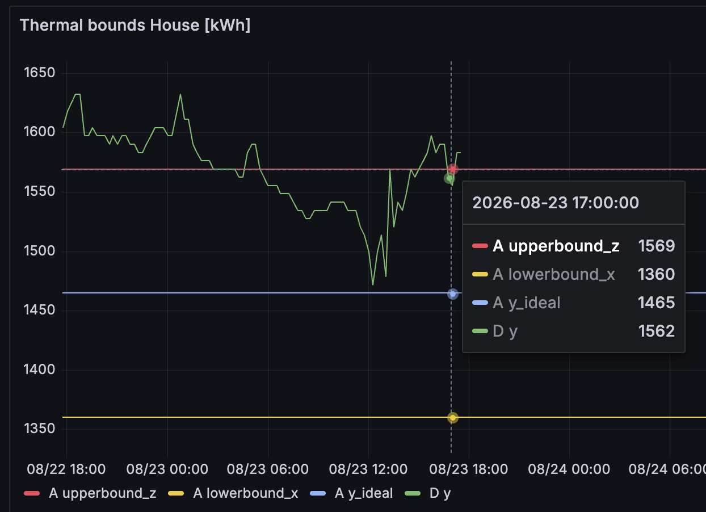

## Overview

The **NOX Control Package** provides access to:
* Device information
* Energy consumption data.
    * Forecasted consumption (= nomination)
    * Actual consumption
    * Typical consumption if NOX would not have altered the device steering.
* Changing user Settings
* Deleting a user

The **Partner Control Package** provides additional access to:
* Heat pump current state and forecasted state expressed as a Battery.
* Controling the heat pump by submitting a control schedule.

## Getting Started

### Prerequisites
* Valid NOX API key (see [Authentication](/api-docs/authentication))

### Base URL
All endpoints use the base URL:
- Sandbox: `https://api.sandbox.nox.energy`
- Production: `https://api.nox.energy`

## Core Workflows

<Note>
    All our collection api endpoints use a `next_token` to paginate through results if the size limit of the response has been reached.
    To paginate through a response, you can use the `next_token` received in the response as a query parameter and call the same endpoint with
    the same parameters again. You can repeat this process until you have received the last page of the response, which is signified
    by the `next_token` field becoming `null`.
</Note>

### 1. Getting Device Information

To fetch all devices configuration data you can call the following endpoint:

<CodeGroup dropdown>

```bash cURL
curl -X GET "https://api.nox.energy/v1/devices" \
  -H "x-api-key: YOUR_API_KEY" \
  -H "Content-Type: application/json"
```

```python Python

import requests

url = "https://api.nox.energy/v1/devices"

headers = {"x-api-key": "<api-key>"}

response = requests.request("GET", url, headers=headers)

print(response.text)
```

```javascript JavasScript
const options = {method: 'GET', headers: {'x-api-key': '<api-key>'}};

fetch('https://api.nox.energy/v1/devices', options)
  .then(response => response.json())
  .then(response => console.log(response))
  .catch(err => console.error(err));
```

```php PHP
<?php

$curl = curl_init();

curl_setopt_array($curl, [
  CURLOPT_URL => "https://api.nox.energy/v1/devices?limit=1000",
  CURLOPT_RETURNTRANSFER => true,
  CURLOPT_ENCODING => "",
  CURLOPT_MAXREDIRS => 10,
  CURLOPT_TIMEOUT => 30,
  CURLOPT_HTTP_VERSION => CURL_HTTP_VERSION_1_1,
  CURLOPT_CUSTOMREQUEST => "GET",
  CURLOPT_HTTPHEADER => [
    "x-api-key: <api-key>"
  ],
]);

$response = curl_exec($curl);
$err = curl_error($curl);

curl_close($curl);

if ($err) {
  echo "cURL Error #:" . $err;
} else {
  echo $response;
}
```

```go Go
package main

import (
	"fmt"
	"net/http"
	"io"
)

func main() {

	url := "https://api.nox.energy/v1/devices?limit=1000"

	req, _ := http.NewRequest("GET", url, nil)

	req.Header.Add("x-api-key", "<api-key>")

	res, _ := http.DefaultClient.Do(req)

	defer res.Body.Close()
	body, _ := io.ReadAll(res.Body)

	fmt.Println(string(body))

}
```

```java Java
HttpResponse<String> response = Unirest.get("https://api.nox.energy/v1/devices?limit=1000")
  .header("x-api-key", "<api-key>")
  .asString();
```

```ruby Ruby
require 'uri'
require 'net/http'

url = URI("https://api.nox.energy/v1/devices?limit=1000")

http = Net::HTTP.new(url.host, url.port)
http.use_ssl = true

request = Net::HTTP::Get.new(url)
request["x-api-key"] = '<api-key>'

response = http.request(request)
puts response.read_body
```

</CodeGroup>

However, how you should use the [/devices](/api-docs/hp/asset-info/get-devices) endpoint is to fetch device info
after the user completed the [authentication flow](/guides/new-asset-integration). You should have received the `user_id` and/or `device_id` in the
redirect_uri callback parameters. Use the parameters received from the redirect and the
[/devices](/api-docs/hp/asset-info/get-devices) endpoint to fetch on a per `user_id` or per `device_id` basis.
This can be done using the query parameters like the below example:

<CodeGroup dropdown>

```bash cURL
curl --request GET \
  --url 'https://api.nox.energy/v1/devices?limit=1000&user_id=user_id_1' \
  --header 'x-api-key: <api-key>'
```

```python Python
import requests

url = "https://api.nox.energy/v1/devices?limit=1000&user_id=user_id_1"

headers = {"x-api-key": "<api-key>"}

response = requests.get(url, headers=headers)

print(response.text)
```

```javascript JavasScript
const options = {method: 'GET', headers: {'x-api-key': '<api-key>'}};

fetch('https://api.nox.energy/v1/devices?limit=1000&user_id=user_id_1', options)
  .then(res => res.json())
  .then(res => console.log(res))
  .catch(err => console.error(err));
```

```php PHP
<?php

$curl = curl_init();

curl_setopt_array($curl, [
  CURLOPT_URL => "https://api.nox.energy/v1/devices?limit=1000&user_id=user_id_1",
  CURLOPT_RETURNTRANSFER => true,
  CURLOPT_ENCODING => "",
  CURLOPT_MAXREDIRS => 10,
  CURLOPT_TIMEOUT => 30,
  CURLOPT_HTTP_VERSION => CURL_HTTP_VERSION_1_1,
  CURLOPT_CUSTOMREQUEST => "GET",
  CURLOPT_HTTPHEADER => [
    "x-api-key: <api-key>"
  ],
]);

$response = curl_exec($curl);
$err = curl_error($curl);

curl_close($curl);

if ($err) {
  echo "cURL Error #:" . $err;
} else {
  echo $response;
}
```

```go Go
package main

import (
	"fmt"
	"net/http"
	"io"
)

func main() {

	url := "https://api.nox.energy/v1/devices?limit=1000&user_id=user_id_1"

	req, _ := http.NewRequest("GET", url, nil)

	req.Header.Add("x-api-key", "<api-key>")

	res, _ := http.DefaultClient.Do(req)

	defer res.Body.Close()
	body, _ := io.ReadAll(res.Body)

	fmt.Println(string(body))

}
```

```java Java
HttpResponse<String> response = Unirest.get("https://api.nox.energy/v1/devices?limit=1000&user_id=user_id_1")
  .header("x-api-key", "<api-key>")
  .asString();
```

```ruby Ruby
require 'uri'
require 'net/http'

url = URI("https://api.nox.energy/v1/devices?limit=1000&user_id=user_id_1")

http = Net::HTTP.new(url.host, url.port)
http.use_ssl = true

request = Net::HTTP::Get.new(url)
request["x-api-key"] = '<api-key>'

response = http.request(request)
puts response.read_body
```

</CodeGroup>

**Key response fields:**
- `device_id` - Unique identifier per device. Each nox user_id can have multiple device_id's.
- `brand` - Manufacturer brand of the device. We currently only support 1 heat pump brand per user. If a user has multiple brands, during the auth process, a new user_id is created.
- `model_type` - Signifies the type of device (e.g. air-to-water/air-to-air/... device)
- `has_delayed_power_data_1d` - Signifies if the device can or cannot provide real-time power data but instead
provides its power data with a delay of 1 day between 2-4 AM UTC of the full previous day.

If there is a need to have real-time data updates on specific fields.
You can request us to see data change events from some of these fields like
`needs_reauthentication` through our [webhook](/guides/partner-webhooks). You can communicate to us which fields you are interested in and
we can set up a custom webhook with a POST endpoint you provide to us and you will receive real-time updates on change events.

We suggest you read [Partner webhooks](/guides/partner-webhooks) page for more info.

A lot of query parameters exist on the [/devices](/api-docs/hp/asset-info/get-devices) we recommend you to use them
if relevant, to reduces the size of data transfer.

### 2. Retrieving Consumption Data

#### 2.1 Historical Consumption
Get actual measured consumption data of all devices of a certain timeframe:

<CodeGroup dropdown>

```bash cURL
curl --request GET \
  --url 'https://api.nox.energy/v1/device/consumption/historical?limit=1000&end_time=2026-03-22T16%3A30%3A00Z&start_time=2026-03-22T16%3A15%3A00Z' \
  --header 'x-api-key: <api-key>'
```

```python Python
import requests

url = "https://api.nox.energy/v1/device/consumption/historical?limit=1000&end_time=2026-03-22T16%3A30%3A00Z&start_time=2026-03-22T16%3A15%3A00Z"

headers = {"x-api-key": "<api-key>"}

response = requests.get(url, headers=headers)

print(response.text)
```

```javascript JavasScript
const options = {method: 'GET', headers: {'x-api-key': '<api-key>'}};

fetch('https://api.nox.energy/v1/device/consumption/historical?limit=1000&end_time=2026-03-22T16%3A30%3A00Z&start_time=2026-03-22T16%3A15%3A00Z', options)
  .then(res => res.json())
  .then(res => console.log(res))
  .catch(err => console.error(err));
```

```php PHP
<?php

$curl = curl_init();

curl_setopt_array($curl, [
  CURLOPT_URL => "https://api.nox.energy/v1/device/consumption/historical?limit=1000&end_time=2026-03-22T16%3A30%3A00Z&start_time=2026-03-22T16%3A15%3A00Z",
  CURLOPT_RETURNTRANSFER => true,
  CURLOPT_ENCODING => "",
  CURLOPT_MAXREDIRS => 10,
  CURLOPT_TIMEOUT => 30,
  CURLOPT_HTTP_VERSION => CURL_HTTP_VERSION_1_1,
  CURLOPT_CUSTOMREQUEST => "GET",
  CURLOPT_HTTPHEADER => [
    "x-api-key: <api-key>"
  ],
]);

$response = curl_exec($curl);
$err = curl_error($curl);

curl_close($curl);

if ($err) {
  echo "cURL Error #:" . $err;
} else {
  echo $response;
}
```

```go Go
package main

import (
	"fmt"
	"net/http"
	"io"
)

func main() {

	url := "https://api.nox.energy/v1/device/consumption/historical?limit=1000&end_time=2026-03-22T16%3A30%3A00Z&start_time=2026-03-22T16%3A15%3A00Z"

	req, _ := http.NewRequest("GET", url, nil)

	req.Header.Add("x-api-key", "<api-key>")

	res, _ := http.DefaultClient.Do(req)

	defer res.Body.Close()
	body, _ := io.ReadAll(res.Body)

	fmt.Println(string(body))

}
```

```java Java
HttpResponse<String> response = Unirest.get("https://api.nox.energy/v1/device/consumption/historical?limit=1000&end_time=2026-03-22T16%3A30%3A00Z&start_time=2026-03-22T16%3A15%3A00Z")
  .header("x-api-key", "<api-key>")
  .asString();
```

```ruby Ruby
require 'uri'
require 'net/http'

url = URI("https://api.nox.energy/v1/device/consumption/historical?limit=1000&end_time=2026-03-22T16%3A30%3A00Z&start_time=2026-03-22T16%3A15%3A00Z")

http = Net::HTTP.new(url.host, url.port)
http.use_ssl = true

request = Net::HTTP::Get.new(url)
request["x-api-key"] = '<api-key>'

response = http.request(request)
puts response.read_body
```

</CodeGroup>

If you are interested in real-time energy consumption in kWh, we recommend to query the endpoint every 15 minutes for the past 15minutes timeframe.
Our consumption data is provided in 15-minute granularity at quarter hours. We recommend to query the endpoint with quarter hour timestamps
(e.g. 16:00, 16:15, 16:30, etc.) for the past 15 minutes timeframe to get the most up-to-date data.

If you query shorter than 15 minutes in the past, you might already see a record for the current quarter hour timestamp but the consumption value
might still update until the end of the quarter hour. You should not rely on this as having per minute granularity consumption data.

If you are interested in aggregated consumption data across all devices, you can use the `aggregated=true` query parameter to
get the aggregated consumption across all devices.

If you are not interested in aggregated data but on a per device basis, you should use the query parameter `device_id` to get the consumption data on a per device basis.
Another option is to query without providing the `device_id` query parameter but loop over the same api call using the `next_token` query parameter
to paginate through the data of all devices. We would only recommend this option if you are interested in all devices data and if your timeframe you are querying is small (e.g. 15minutes)
as the amount of data can become quite large if you query a long timeframe and have many devices.

More info about the [/device/consumption/historical](/api-docs/hp/asset-info/get-device-consumption-historical) endpoint.

#### 2.2 Forecasted Consumption
Get forecasted (= nominated) consumption data for all devices of a certain timeframe:

<CodeGroup dropdown>

```bash cURL
curl --request GET \
  --url 'https://api.nox.energy/v1/device/consumption/forecast/historical?limit=1000&start_time=2023-10-01T00%3A00%3A00Z&end_time=2023-10-02T00%3A00%3A00Z' \
  --header 'x-api-key: <api-key>'
```

```python Python
import requests

url = "https://api.nox.energy/v1/device/consumption/forecast/historical?limit=1000&start_time=2023-10-01T00%3A00%3A00Z&end_time=2023-10-02T00%3A00%3A00Z"

headers = {"x-api-key": "<api-key>"}

response = requests.get(url, headers=headers)

print(response.text)
```

```javascript JavasScript
const options = {method: 'GET', headers: {'x-api-key': '<api-key>'}};

fetch('https://api.nox.energy/v1/device/consumption/forecast/historical?limit=1000&start_time=2023-10-01T00%3A00%3A00Z&end_time=2023-10-02T00%3A00%3A00Z', options)
  .then(res => res.json())
  .then(res => console.log(res))
  .catch(err => console.error(err));
```

```php PHP
<?php

$curl = curl_init();

curl_setopt_array($curl, [
  CURLOPT_URL => "https://api.nox.energy/v1/device/consumption/forecast/historical?limit=1000&start_time=2023-10-01T00%3A00%3A00Z&end_time=2023-10-02T00%3A00%3A00Z",
  CURLOPT_RETURNTRANSFER => true,
  CURLOPT_ENCODING => "",
  CURLOPT_MAXREDIRS => 10,
  CURLOPT_TIMEOUT => 30,
  CURLOPT_HTTP_VERSION => CURL_HTTP_VERSION_1_1,
  CURLOPT_CUSTOMREQUEST => "GET",
  CURLOPT_HTTPHEADER => [
    "x-api-key: <api-key>"
  ],
]);

$response = curl_exec($curl);
$err = curl_error($curl);

curl_close($curl);

if ($err) {
  echo "cURL Error #:" . $err;
} else {
  echo $response;
}
```

```go Go
package main

import (
	"fmt"
	"net/http"
	"io"
)

func main() {

	url := "https://api.nox.energy/v1/device/consumption/forecast/historical?limit=1000&start_time=2023-10-01T00%3A00%3A00Z&end_time=2023-10-02T00%3A00%3A00Z"

	req, _ := http.NewRequest("GET", url, nil)

	req.Header.Add("x-api-key", "<api-key>")

	res, _ := http.DefaultClient.Do(req)

	defer res.Body.Close()
	body, _ := io.ReadAll(res.Body)

	fmt.Println(string(body))

}
```

```java Java
HttpResponse<String> response = Unirest.get("https://api.nox.energy/v1/device/consumption/forecast/historical?limit=1000&start_time=2023-10-01T00%3A00%3A00Z&end_time=2023-10-02T00%3A00%3A00Z")
  .header("x-api-key", "<api-key>")
  .asString();
```

```ruby Ruby
require 'uri'
require 'net/http'

url = URI("https://api.nox.energy/v1/device/consumption/forecast/historical?limit=1000&start_time=2023-10-01T00%3A00%3A00Z&end_time=2023-10-02T00%3A00%3A00Z")

http = Net::HTTP.new(url.host, url.port)
http.use_ssl = true

request = Net::HTTP::Get.new(url)
request["x-api-key"] = '<api-key>'

response = http.request(request)
puts response.read_body
```

</CodeGroup>

This endpoint works very similar as the [/device/consumption/historical](/api-docs/hp/asset-info/get-device-consumption-historical) endpoint.
We recommend you to read the explanation at [historical consumption](/guides/hp-api-guide#2-1-historical-consumption) first.

The biggest difference in this endpoint is that it also contains forecasted data for the future. This is data forecasting 1-2 days starting from the next day.
How far in the future and when the forecasted data is provided, depends on your needs. Example: If you wants us to provide forecasted data at
 11 AM CET everyday for the next day. Then the data will be provided at 11 AM CET and the data contained will be from 00:00 UTC until 23:45 UTC of the next day.

We recommend to use a 24h timeframe at the agreed forecast generation time with a `device_id` query parameter.

More info about the [/device/consumption/forecast/historical](/api-docs/hp/asset-info/get-device-consumption-forecast-historical) endpoint.

#### 2.3 Typical Consumption:
Get baseline consumption:

<CodeGroup dropdown>

```bash cURL
curl --request GET \
  --url 'https://api.nox.energy/v1/device/typical-consumption/historical?limit=1000&end_time=2023-10-02T00%3A00%3A00Z&start_time=2023-10-01T00%3A00%3A00Z' \
  --header 'x-api-key: <api-key>'
```

```python Python
import requests

url = "https://api.nox.energy/v1/device/typical-consumption/historical?limit=1000&start_time=2023-10-01T00%3A00%3A00Z&end_time=2023-10-02T00%3A00%3A00Z"

headers = {"x-api-key": "<api-key>"}

response = requests.get(url, headers=headers)

print(response.text)
```

```javascript JavasScript
const options = {method: 'GET', headers: {'x-api-key': '<api-key>'}};

fetch('https://api.nox.energy/v1/device/typical-consumption/historical?limit=1000&start_time=2023-10-01T00%3A00%3A00Z&end_time=2023-10-02T00%3A00%3A00Z', options)
  .then(res => res.json())
  .then(res => console.log(res))
  .catch(err => console.error(err));
```

```php PHP
<?php

$curl = curl_init();

curl_setopt_array($curl, [
  CURLOPT_URL => "https://api.nox.energy/v1/device/typical-consumption/historical?limit=1000&start_time=2023-10-01T00%3A00%3A00Z&end_time=2023-10-02T00%3A00%3A00Z",
  CURLOPT_RETURNTRANSFER => true,
  CURLOPT_ENCODING => "",
  CURLOPT_MAXREDIRS => 10,
  CURLOPT_TIMEOUT => 30,
  CURLOPT_HTTP_VERSION => CURL_HTTP_VERSION_1_1,
  CURLOPT_CUSTOMREQUEST => "GET",
  CURLOPT_HTTPHEADER => [
    "x-api-key: <api-key>"
  ],
]);

$response = curl_exec($curl);
$err = curl_error($curl);

curl_close($curl);

if ($err) {
  echo "cURL Error #:" . $err;
} else {
  echo $response;
}
```

```go Go
package main

import (
	"fmt"
	"net/http"
	"io"
)

func main() {

	url := "https://api.nox.energy/v1/device/typical-consumption/historical?limit=1000&start_time=2023-10-01T00%3A00%3A00Z&end_time=2023-10-02T00%3A00%3A00Z"

	req, _ := http.NewRequest("GET", url, nil)

	req.Header.Add("x-api-key", "<api-key>")

	res, _ := http.DefaultClient.Do(req)

	defer res.Body.Close()
	body, _ := io.ReadAll(res.Body)

	fmt.Println(string(body))

}
```

```java Java
HttpResponse<String> response = Unirest.get("https://api.nox.energy/v1/device/typical-consumption/historical?limit=1000&start_time=2023-10-01T00%3A00%3A00Z&end_time=2023-10-02T00%3A00%3A00Z")
  .header("x-api-key", "<api-key>")
  .asString();
```

```ruby Ruby
require 'uri'
require 'net/http'

url = URI("https://api.nox.energy/v1/device/typical-consumption/historical?limit=1000&start_time=2023-10-01T00%3A00%3A00Z&end_time=2023-10-02T00%3A00%3A00Z")

http = Net::HTTP.new(url.host, url.port)
http.use_ssl = true

request = Net::HTTP::Get.new(url)
request["x-api-key"] = '<api-key>'

response = http.request(request)
puts response.read_body
```

</CodeGroup>

This endpoint works very similar as the [/device/consumption/historical](/api-docs/hp/asset-info/get-device-consumption-historical) endpoint.
We recommend you to read the explanation at [historical consumption](/guides/hp-api-guide#2-1-historical-consumption) first.

The biggest difference in this endpoint is that it contains data of at least 1 day ago. This is data generated at 3 AM UTC for the full previous UTC day.

More info about the [/device/typical-consumption/historical](/api-docs/hp/asset-info/get-device-typical-consumption-historical) endpoint.

### 3. Managing User/Device Settings

Update user preferences and optimization settings on a per user/device basis. We recommend to directly go to the endpoint documentation of
[/devices/settings](/api-docs/hp/user-management/patch-devices-settings) to seel all possible settings you can change.

We recommend to at least implement the following settings options in your UI components of your website/app:

* Preferred temperature
* Room comfort bounds
* Manufacturer schedule on/off
* Optimization Settings (but not flex trading as this is mutually exclusive with other optimizations and should only be enabled if you are a supplier that is using the partner control package)

We recommend to at least implement the following from a backend perspective:

* Location information for better forecasting and optimization results:
    * Country
    * Postal code
* [Webhooks](/guides/partner-webhooks) setup -> Real-time settings sync between all parties

### 4. Deleting a User

You can delete a single user. This operation will delete all data associated with the user_id. This is a irreversible operation and disconnects the devices.
Once deleted, we can no longer provide energy consumption data of the devices of the user.
We recommend to only use this endpoint if the user explicitly requests to delete their data from your side or when the user switches to another energy supplier.

More info at the endpoint documentation of [/user](/api-docs/hp/user-management/delete-user).

### 5. Heat pumps as a thermal battery

#### 5.1 Getting Heat pump information representated as a battery

<Note>
    This feature only exists if you are using the partner control package. If you are using the NOX control package, you can skip this section.
</Note>

The heat pump's thermal model is exposed as two virtual batteries: the **domestic hot water (DHW) tank** and the **house** (space heating/cooling). Each has an energy state, comfort bounds, and a power draw per heating/cooling stage ("activation level").
This is very similar to a battery's state-of-charge, min/max limits, and charge/discharge power.
We have 2 endpoints. One returns the current state, which should mainly be used for monitoring of unexpected events like getting close to the comfort bounds of the user.
The other returns a forecast of the energy state and comfort bounds, which should mainly be used for scheduling of the heat pump controls within your control algorithm.



**Current state** returns the latest 15-minute snapshot:

<CodeGroup dropdown>

```bash cURL
curl --request GET \
  --url 'https://api.nox.energy/v1/device/thermal-control/current-state?device_id=HP123456' \
  --header 'x-api-key: <api-key>'
```

```python Python
import requests

url = "https://api.nox.energy/v1/device/thermal-control/current-state?device_id=HP123456"

headers = {"x-api-key": "<api-key>"}

response = requests.get(url, headers=headers)

print(response.text)
```

```javascript JavasScript
const options = {method: 'GET', headers: {'x-api-key': '<api-key>'}};

fetch('https://api.nox.energy/v1/device/thermal-control/current-state?device_id=HP123456', options)
  .then(res => res.json())
  .then(res => console.log(res))
  .catch(err => console.error(err));
```

```php PHP
<?php

$curl = curl_init();

curl_setopt_array($curl, [
  CURLOPT_URL => "https://api.nox.energy/v1/device/thermal-control/current-state?device_id=HP123456",
  CURLOPT_RETURNTRANSFER => true,
  CURLOPT_ENCODING => "",
  CURLOPT_MAXREDIRS => 10,
  CURLOPT_TIMEOUT => 30,
  CURLOPT_HTTP_VERSION => CURL_HTTP_VERSION_1_1,
  CURLOPT_CUSTOMREQUEST => "GET",
  CURLOPT_HTTPHEADER => [
    "x-api-key: <api-key>"
  ],
]);

$response = curl_exec($curl);
$err = curl_error($curl);

curl_close($curl);

if ($err) {
  echo "cURL Error #:" . $err;
} else {
  echo $response;
}
```

```go Go
package main

import (
	"fmt"
	"net/http"
	"io"
)

func main() {

	url := "https://api.nox.energy/v1/device/thermal-control/current-state?device_id=HP123456"

	req, _ := http.NewRequest("GET", url, nil)

	req.Header.Add("x-api-key", "<api-key>")

	res, _ := http.DefaultClient.Do(req)

	defer res.Body.Close()
	body, _ := io.ReadAll(res.Body)

	fmt.Println(string(body))

}
```

```java Java
HttpResponse<String> response = Unirest.get("https://api.nox.energy/v1/device/thermal-control/current-state?device_id=HP123456")
  .header("x-api-key", "<api-key>")
  .asString();
```

```ruby Ruby
require 'uri'
require 'net/http'

url = URI("https://api.nox.energy/v1/device/thermal-control/current-state?device_id=HP123456")

http = Net::HTTP.new(url.host, url.port)
http.use_ssl = true

request = Net::HTTP::Get.new(url)
request["x-api-key"] = '<api-key>'

response = http.request(request)
puts response.read_body
```

</CodeGroup>

Key fields:
- `Y` – current energy state of the tank/house in kWh (think state-of-charge). Only present when `unit=kWh` (default).
- `DHW_temperature` / `Space_temperature` – current temperature in °C, returned regardless of `unit`.
- `Q_gain` / `Q_loss` (or `T_gain` / `T_loss` with `unit=celsius`) – how fast the tank/house gains or loses energy at each activation level.
- `P_if_activated` / `P_heating` / `P_cooling` – power (kW) the heat pump draws at each activation level.

More info at [/device/thermal-control/current-state](/api-docs/hp/thermal-battery-control/get-thermal-control-current-state).

**Forecast** returns the same fields projected forward in 15-minute steps, plus the comfort bounds you need to respect when scheduling:

<CodeGroup dropdown>

```bash cURL
curl --request GET \
  --url 'https://api.nox.energy/v1/device/thermal-control/forecast?device_id=HP123456&start_time=2023-10-01T00%3A00%3A00Z&end_time=2023-10-02T00%3A00%3A00Z' \
  --header 'x-api-key: <api-key>'
```

```python Python
import requests

url = "https://api.nox.energy/v1/device/thermal-control/forecast?device_id=HP123456&start_time=2023-10-01T00%3A00%3A00Z&end_time=2023-10-02T00%3A00%3A00Z"

headers = {"x-api-key": "<api-key>"}

response = requests.get(url, headers=headers)

print(response.text)
```

```javascript JavasScript
const options = {method: 'GET', headers: {'x-api-key': '<api-key>'}};

fetch('https://api.nox.energy/v1/device/thermal-control/forecast?device_id=HP123456&start_time=2023-10-01T00%3A00%3A00Z&end_time=2023-10-02T00%3A00%3A00Z', options)
  .then(res => res.json())
  .then(res => console.log(res))
  .catch(err => console.error(err));
```

```php PHP
<?php

$curl = curl_init();

curl_setopt_array($curl, [
  CURLOPT_URL => "https://api.nox.energy/v1/device/thermal-control/forecast?device_id=HP123456&start_time=2023-10-01T00%3A00%3A00Z&end_time=2023-10-02T00%3A00%3A00Z",
  CURLOPT_RETURNTRANSFER => true,
  CURLOPT_ENCODING => "",
  CURLOPT_MAXREDIRS => 10,
  CURLOPT_TIMEOUT => 30,
  CURLOPT_HTTP_VERSION => CURL_HTTP_VERSION_1_1,
  CURLOPT_CUSTOMREQUEST => "GET",
  CURLOPT_HTTPHEADER => [
    "x-api-key: <api-key>"
  ],
]);

$response = curl_exec($curl);
$err = curl_error($curl);

curl_close($curl);

if ($err) {
  echo "cURL Error #:" . $err;
} else {
  echo $response;
}
```

```go Go
package main

import (
	"fmt"
	"net/http"
	"io"
)

func main() {

	url := "https://api.nox.energy/v1/device/thermal-control/forecast?device_id=HP123456&start_time=2023-10-01T00%3A00%3A00Z&end_time=2023-10-02T00%3A00%3A00Z"

	req, _ := http.NewRequest("GET", url, nil)

	req.Header.Add("x-api-key", "<api-key>")

	res, _ := http.DefaultClient.Do(req)

	defer res.Body.Close()
	body, _ := io.ReadAll(res.Body)

	fmt.Println(string(body))

}
```

```java Java
HttpResponse<String> response = Unirest.get("https://api.nox.energy/v1/device/thermal-control/forecast?device_id=HP123456&start_time=2023-10-01T00%3A00%3A00Z&end_time=2023-10-02T00%3A00%3A00Z")
  .header("x-api-key", "<api-key>")
  .asString();
```

```ruby Ruby
require 'uri'
require 'net/http'

url = URI("https://api.nox.energy/v1/device/thermal-control/forecast?device_id=HP123456&start_time=2023-10-01T00%3A00%3A00Z&end_time=2023-10-02T00%3A00%3A00Z")

http = Net::HTTP.new(url.host, url.port)
http.use_ssl = true

request = Net::HTTP::Get.new(url)
request["x-api-key"] = '<api-key>'

response = http.request(request)
puts response.read_body
```

</CodeGroup>

Key fields:
- `upperbound_Z` / `lowerbound_X` – comfort bounds the energy state must stay within.
- `Y_avg` (and `Y_ideal` for the house) – expected/ideal state if left unsteered.
- `tank_activation_limit` – tank state below which DHW heating should trigger to stay in bounds.

We recommend you to only query the `forecast` once per hour or less.
The comfort bounds might change depending on if the heat pump is switching between a heating day or a cooling day or if the users changes their comfort bounds with the user settings api endpoint.

More info at [/device/thermal-control/forecast](/api-docs/hp/thermal-battery-control/get-thermal-control-forecast).

#### 5.2 Controlling the heat pump

<Note>
    This feature only exists if you are using the partner control package. If you are using the NOX control package, you can skip this section.
</Note>

Submit a 24-hour steering schedule with `POST /device/thermal-control/schedule`. The schedule has 96 slots of 15 minutes each, starting from the next quarter-hour (e.g. submit at 10:07 → the schedule runs from 10:15 to 10:00 the next day). Only submit a new schedule when you actually want to change it.

<CodeGroup dropdown>

```bash cURL
curl --request POST \
  --url https://api.nox.energy/v1/device/thermal-control/schedule \
  --header 'x-api-key: <api-key>' \
  --header 'Content-Type: application/json' \
  --data '{
  "device_id": "HP123456",
  "timestamp": "2025-08-05T10:15:00Z",
  "house_heating": [true, false, false, true, false, false, false, false],
  "house_cooling": [false, false, false, false, false, false, false, false],
  "tank": [false, false, true, false, false, false, false, false]
}'
```

```python Python
import requests

url = "https://api.nox.energy/v1/device/thermal-control/schedule"

headers = {"x-api-key": "<api-key>", "Content-Type": "application/json"}

payload = {
    "device_id": "HP123456",
    "timestamp": "2025-08-05T10:15:00Z",
    "house_heating": [True, False, False, True, False, False, False, False],
    "house_cooling": [False, False, False, False, False, False, False, False],
    "tank": [False, False, True, False, False, False, False, False]
}

response = requests.post(url, headers=headers, json=payload)

print(response.text)
```

```javascript JavasScript
const options = {
  method: 'POST',
  headers: {'x-api-key': '<api-key>', 'Content-Type': 'application/json'},
  body: JSON.stringify({
    device_id: 'HP123456',
    timestamp: '2025-08-05T10:15:00Z',
    house_heating: [true, false, false, true, false, false, false, false],
    house_cooling: [false, false, false, false, false, false, false, false],
    tank: [false, false, true, false, false, false, false, false]
  })
};

fetch('https://api.nox.energy/v1/device/thermal-control/schedule', options)
  .then(res => res.json())
  .then(res => console.log(res))
  .catch(err => console.error(err));
```

```php PHP
<?php

$curl = curl_init();

curl_setopt_array($curl, [
  CURLOPT_URL => "https://api.nox.energy/v1/device/thermal-control/schedule",
  CURLOPT_RETURNTRANSFER => true,
  CURLOPT_ENCODING => "",
  CURLOPT_MAXREDIRS => 10,
  CURLOPT_TIMEOUT => 30,
  CURLOPT_HTTP_VERSION => CURL_HTTP_VERSION_1_1,
  CURLOPT_CUSTOMREQUEST => "POST",
  CURLOPT_POSTFIELDS => json_encode([
    "device_id" => "HP123456",
    "timestamp" => "2025-08-05T10:15:00Z",
    "house_heating" => [true, false, false, true, false, false, false, false],
    "house_cooling" => [false, false, false, false, false, false, false, false],
    "tank" => [false, false, true, false, false, false, false, false]
  ]),
  CURLOPT_HTTPHEADER => [
    "x-api-key: <api-key>",
    "Content-Type: application/json"
  ],
]);

$response = curl_exec($curl);
$err = curl_error($curl);

curl_close($curl);

if ($err) {
  echo "cURL Error #:" . $err;
} else {
  echo $response;
}
```

```go Go
package main

import (
	"bytes"
	"encoding/json"
	"fmt"
	"net/http"
	"io"
)

func main() {

	url := "https://api.nox.energy/v1/device/thermal-control/schedule"

	payload, _ := json.Marshal(map[string]interface{}{
		"device_id":     "HP123456",
		"timestamp":     "2025-08-05T10:15:00Z",
		"house_heating": []bool{true, false, false, true, false, false, false, false},
		"house_cooling": []bool{false, false, false, false, false, false, false, false},
		"tank":          []bool{false, false, true, false, false, false, false, false},
	})

	req, _ := http.NewRequest("POST", url, bytes.NewBuffer(payload))

	req.Header.Add("x-api-key", "<api-key>")
	req.Header.Add("Content-Type", "application/json")

	res, _ := http.DefaultClient.Do(req)

	defer res.Body.Close()
	body, _ := io.ReadAll(res.Body)

	fmt.Println(string(body))

}
```

```java Java
HttpResponse<String> response = Unirest.post("https://api.nox.energy/v1/device/thermal-control/schedule")
  .header("x-api-key", "<api-key>")
  .header("Content-Type", "application/json")
  .body("{\"device_id\":\"HP123456\",\"timestamp\":\"2025-08-05T10:15:00Z\",\"house_heating\":[true,false,false,true,false,false,false,false],\"house_cooling\":[false,false,false,false,false,false,false,false],\"tank\":[false,false,true,false,false,false,false,false]}")
  .asString();
```

```ruby Ruby
require 'uri'
require 'net/http'
require 'json'

url = URI("https://api.nox.energy/v1/device/thermal-control/schedule")

http = Net::HTTP.new(url.host, url.port)
http.use_ssl = true

request = Net::HTTP::Post.new(url)
request["x-api-key"] = '<api-key>'
request["Content-Type"] = 'application/json'
request.body = JSON.dump({
  "device_id" => "HP123456",
  "timestamp" => "2025-08-05T10:15:00Z",
  "house_heating" => [true, false, false, true, false, false, false, false],
  "house_cooling" => [false, false, false, false, false, false, false, false],
  "tank" => [false, false, true, false, false, false, false, false]
})

response = http.request(request)
puts response.read_body
```

</CodeGroup>

<Note>
  The `house_heating`, `house_cooling`, and `tank` arrays are shortened to 8 values (2 hours) above for readability. A real request must always send exactly 96 values, one per 15-minute slot covering the next 24 hours.
</Note>

- `house_heating` / `house_cooling` / `tank` – arrays of 96 booleans that switch space heating, space cooling, or DHW tank heating on/off for that slot. Only set `house_cooling` slots to `true` for devices where `has_cooling` is `true` (see `steerable_status` below).
- `timestamp` – optional, defaults to the next quarter-hour. If provided, it must land exactly on a quarter-hour boundary in the future.

Before submitting, check the device's `steerable_status` from [/devices](/api-docs/hp/asset-info/get-devices): `steering_enabled` and `steerable` must both be `true`, and `DHW.can_activate_action` / `room.can_activate_action` tell you whether the tank/house can currently accept a new schedule. If `steerable` is `false`, `general_reason` explains why (e.g. reauthentication required, too many heating zones, still learning the device).

**Failsafes you don't control:**
- DHW tank heating never runs for more than 1 continuous hour, no matter what the schedule says, unless the following field `dhw_max_cycle_time` in `cycle_config` is set to a higher value than 60 minutes in the [devices](/api-docs/hp/asset-info/get-devices) endpoint.
- If the tank or house temperature drifts outside its comfort bounds, we override the schedule with a failsafe heat/cool action until it's back in bounds.

On success:
```json
{
  "status": "success",
  "message": "Steering schedule accepted for HP123456"
}
```

More info at [/device/thermal-control/schedule](/api-docs/hp/hp-control/submit-thermal-control-schedule).

## Next Steps

- Set up [Partner Webhooks](/guides/partner-webhooks) for real-time data updates.