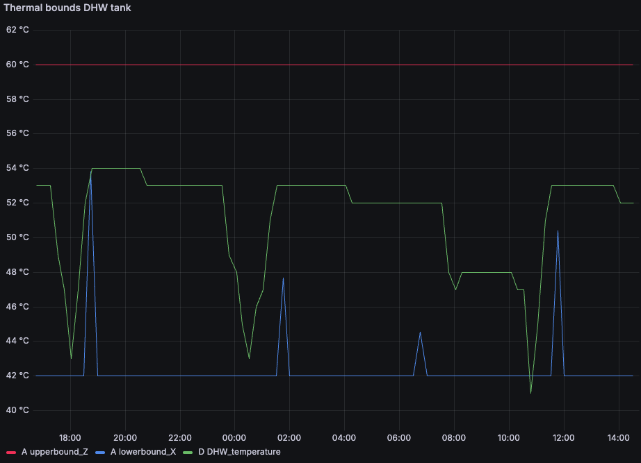

## Overview

The **NOX Control Package** provides access to:
* Device information
* Energy consumption data.
    * Forecasted consumption (= nomination)
    * Actual consumption
    * Typical consumption if NOX would not have altered the device steering.
* Changing user Settings
* Deleting a user

The **Partner Control Package** provides additional access to:
* Heat pump current state and forecasted state expressed as a Battery.
* Controling the heat pump by submitting a control schedule.

## Getting Started

### Prerequisites
* Valid NOX API key (see [Authentication](/api-docs/authentication))

### Base URL
All endpoints use the base URL:
- Sandbox: `https://api.sandbox.nox.energy`
- Production: `https://api.nox.energy`

## Core Workflows

<Note>
    All our collection api endpoints use a `next_token` to paginate through results if the size limit of the response has been reached.
    To paginate through a response, you can use the `next_token` received in the response as a query parameter and call the same endpoint with
    the same parameters again. You can repeat this process until you have received the last page of the response, which is signified
    by the `next_token` field becoming `null`.
</Note>

### 1. Getting Device Information

To fetch all devices configuration data you can call the following endpoint:

<CodeGroup dropdown>

```bash cURL
curl -X GET "https://api.nox.energy/v1/devices" \
  -H "x-api-key: YOUR_API_KEY" \
  -H "Content-Type: application/json"
```

```python Python

import requests

url = "https://api.nox.energy/v1/devices"

headers = {"x-api-key": "<api-key>"}

response = requests.request("GET", url, headers=headers)

print(response.text)
```

```javascript JavasScript
const options = {method: 'GET', headers: {'x-api-key': '<api-key>'}};

fetch('https://api.nox.energy/v1/devices', options)
  .then(response => response.json())
  .then(response => console.log(response))
  .catch(err => console.error(err));
```

```php PHP
<?php

$curl = curl_init();

curl_setopt_array($curl, [
  CURLOPT_URL => "https://api.nox.energy/v1/devices?limit=1000",
  CURLOPT_RETURNTRANSFER => true,
  CURLOPT_ENCODING => "",
  CURLOPT_MAXREDIRS => 10,
  CURLOPT_TIMEOUT => 30,
  CURLOPT_HTTP_VERSION => CURL_HTTP_VERSION_1_1,
  CURLOPT_CUSTOMREQUEST => "GET",
  CURLOPT_HTTPHEADER => [
    "x-api-key: <api-key>"
  ],
]);

$response = curl_exec($curl);
$err = curl_error($curl);

curl_close($curl);

if ($err) {
  echo "cURL Error #:" . $err;
} else {
  echo $response;
}
```

```go Go
package main

import (
	"fmt"
	"net/http"
	"io"
)

func main() {

	url := "https://api.nox.energy/v1/devices?limit=1000"

	req, _ := http.NewRequest("GET", url, nil)

	req.Header.Add("x-api-key", "<api-key>")

	res, _ := http.DefaultClient.Do(req)

	defer res.Body.Close()
	body, _ := io.ReadAll(res.Body)

	fmt.Println(string(body))

}
```

```java Java
HttpResponse<String> response = Unirest.get("https://api.nox.energy/v1/devices?limit=1000")
  .header("x-api-key", "<api-key>")
  .asString();
```

```ruby Ruby
require 'uri'
require 'net/http'

url = URI("https://api.nox.energy/v1/devices?limit=1000")

http = Net::HTTP.new(url.host, url.port)
http.use_ssl = true

request = Net::HTTP::Get.new(url)
request["x-api-key"] = '<api-key>'

response = http.request(request)
puts response.read_body
```

</CodeGroup>

However, how you should use the [/devices](/api-docs/hp/asset-info/get-devices) endpoint is to fetch device info
after the user completed the [authentication flow](/guides/new-asset-integration). You should have received the `user_id` and/or `device_id` in the
redirect_uri callback parameters. Use the parameters received from the redirect and the
[/devices](/api-docs/hp/asset-info/get-devices) endpoint to fetch on a per `user_id` or per `device_id` basis.
This can be done using the query parameters like the below example:

<CodeGroup dropdown>

```bash cURL
curl --request GET \
  --url 'https://api.nox.energy/v1/devices?limit=1000&user_id=user_id_1' \
  --header 'x-api-key: <api-key>'
```

```python Python
import requests

url = "https://api.nox.energy/v1/devices?limit=1000&user_id=user_id_1"

headers = {"x-api-key": "<api-key>"}

response = requests.get(url, headers=headers)

print(response.text)
```

```javascript JavasScript
const options = {method: 'GET', headers: {'x-api-key': '<api-key>'}};

fetch('https://api.nox.energy/v1/devices?limit=1000&user_id=user_id_1', options)
  .then(res => res.json())
  .then(res => console.log(res))
  .catch(err => console.error(err));
```

```php PHP
<?php

$curl = curl_init();

curl_setopt_array($curl, [
  CURLOPT_URL => "https://api.nox.energy/v1/devices?limit=1000&user_id=user_id_1",
  CURLOPT_RETURNTRANSFER => true,
  CURLOPT_ENCODING => "",
  CURLOPT_MAXREDIRS => 10,
  CURLOPT_TIMEOUT => 30,
  CURLOPT_HTTP_VERSION => CURL_HTTP_VERSION_1_1,
  CURLOPT_CUSTOMREQUEST => "GET",
  CURLOPT_HTTPHEADER => [
    "x-api-key: <api-key>"
  ],
]);

$response = curl_exec($curl);
$err = curl_error($curl);

curl_close($curl);

if ($err) {
  echo "cURL Error #:" . $err;
} else {
  echo $response;
}
```

```go Go
package main

import (
	"fmt"
	"net/http"
	"io"
)

func main() {

	url := "https://api.nox.energy/v1/devices?limit=1000&user_id=user_id_1"

	req, _ := http.NewRequest("GET", url, nil)

	req.Header.Add("x-api-key", "<api-key>")

	res, _ := http.DefaultClient.Do(req)

	defer res.Body.Close()
	body, _ := io.ReadAll(res.Body)

	fmt.Println(string(body))

}
```

```java Java
HttpResponse<String> response = Unirest.get("https://api.nox.energy/v1/devices?limit=1000&user_id=user_id_1")
  .header("x-api-key", "<api-key>")
  .asString();
```

```ruby Ruby
require 'uri'
require 'net/http'

url = URI("https://api.nox.energy/v1/devices?limit=1000&user_id=user_id_1")

http = Net::HTTP.new(url.host, url.port)
http.use_ssl = true

request = Net::HTTP::Get.new(url)
request["x-api-key"] = '<api-key>'

response = http.request(request)
puts response.read_body
```

</CodeGroup>

**Key response fields:**
- `device_id` - Unique identifier per device. Each nox user_id can have multiple device_id's.
- `brand` - Manufacturer brand of the device. We currently only support 1 heat pump brand per user. If a user has multiple brands, during the auth process, a new user_id is created.
- `model_type` - Signifies the type of device (e.g. air-to-water/air-to-air/... device)
- `has_delayed_power_data_1d` - Signifies if the device can or cannot provide real-time power data but instead
provides its power data with a delay of 1 day between 2-4 AM UTC of the full previous day.

If there is a need to have real-time data updates on specific fields.
You can request us to see data change events from some of these fields like
`needs_reauthentication` through our [webhook](/guides/partner-webhooks). You can communicate to us which fields you are interested in and
we can set up a custom webhook with a POST endpoint you provide to us and you will receive real-time updates on change events.

We suggest you read [Partner webhooks](/guides/partner-webhooks) page for more info.

Alternatively, you can also use the [/devices/telemetry/current](/api-docs/hp/asset-info/get-devices-hp-current-telemetry) endpoint to poll for current telemetry data.
This is only recommended if you are interested to show real time data temporarily for users when they are interacting with your app. This is not meant as a solution to have consistently higher granularity telemetry data.
If you want higher granularity telemetry data then we recommend you to use our [webhook](/guides/partner-webhooks) solution to receive real-time updates on change events.

A lot of query parameters exist on the [/devices](/api-docs/hp/asset-info/get-devices) we recommend you to use them
if relevant, to reduces the size of data transfer.

### 2. Retrieving Consumption Data

#### 2.1 Historical Consumption
Get actual measured consumption data of all devices of a certain timeframe:

<CodeGroup dropdown>

```bash cURL
curl --request GET \
  --url 'https://api.nox.energy/v1/device/consumption/historical?limit=1000&end_time=2026-03-22T16%3A30%3A00Z&start_time=2026-03-22T16%3A15%3A00Z' \
  --header 'x-api-key: <api-key>'
```

```python Python
import requests

url = "https://api.nox.energy/v1/device/consumption/historical?limit=1000&end_time=2026-03-22T16%3A30%3A00Z&start_time=2026-03-22T16%3A15%3A00Z"

headers = {"x-api-key": "<api-key>"}

response = requests.get(url, headers=headers)

print(response.text)
```

```javascript JavasScript
const options = {method: 'GET', headers: {'x-api-key': '<api-key>'}};

fetch('https://api.nox.energy/v1/device/consumption/historical?limit=1000&end_time=2026-03-22T16%3A30%3A00Z&start_time=2026-03-22T16%3A15%3A00Z', options)
  .then(res => res.json())
  .then(res => console.log(res))
  .catch(err => console.error(err));
```

```php PHP
<?php

$curl = curl_init();

curl_setopt_array($curl, [
  CURLOPT_URL => "https://api.nox.energy/v1/device/consumption/historical?limit=1000&end_time=2026-03-22T16%3A30%3A00Z&start_time=2026-03-22T16%3A15%3A00Z",
  CURLOPT_RETURNTRANSFER => true,
  CURLOPT_ENCODING => "",
  CURLOPT_MAXREDIRS => 10,
  CURLOPT_TIMEOUT => 30,
  CURLOPT_HTTP_VERSION => CURL_HTTP_VERSION_1_1,
  CURLOPT_CUSTOMREQUEST => "GET",
  CURLOPT_HTTPHEADER => [
    "x-api-key: <api-key>"
  ],
]);

$response = curl_exec($curl);
$err = curl_error($curl);

curl_close($curl);

if ($err) {
  echo "cURL Error #:" . $err;
} else {
  echo $response;
}
```

```go Go
package main

import (
	"fmt"
	"net/http"
	"io"
)

func main() {

	url := "https://api.nox.energy/v1/device/consumption/historical?limit=1000&end_time=2026-03-22T16%3A30%3A00Z&start_time=2026-03-22T16%3A15%3A00Z"

	req, _ := http.NewRequest("GET", url, nil)

	req.Header.Add("x-api-key", "<api-key>")

	res, _ := http.DefaultClient.Do(req)

	defer res.Body.Close()
	body, _ := io.ReadAll(res.Body)

	fmt.Println(string(body))

}
```

```java Java
HttpResponse<String> response = Unirest.get("https://api.nox.energy/v1/device/consumption/historical?limit=1000&end_time=2026-03-22T16%3A30%3A00Z&start_time=2026-03-22T16%3A15%3A00Z")
  .header("x-api-key", "<api-key>")
  .asString();
```

```ruby Ruby
require 'uri'
require 'net/http'

url = URI("https://api.nox.energy/v1/device/consumption/historical?limit=1000&end_time=2026-03-22T16%3A30%3A00Z&start_time=2026-03-22T16%3A15%3A00Z")

http = Net::HTTP.new(url.host, url.port)
http.use_ssl = true

request = Net::HTTP::Get.new(url)
request["x-api-key"] = '<api-key>'

response = http.request(request)
puts response.read_body
```

</CodeGroup>

If you are interested in real-time energy consumption in kWh, we recommend to query the endpoint every 15 minutes for the past 15minutes timeframe.
Our consumption data is provided in 15-minute granularity at quarter hours. We recommend to query the endpoint with quarter hour timestamps
(e.g. 16:00, 16:15, 16:30, etc.) for the past 15 minutes timeframe to get the most up-to-date data.

If you query shorter than 15 minutes in the past, you might already see a record for the current quarter hour timestamp but the consumption value
might still update until the end of the quarter hour. You should not rely on this as having per minute granularity consumption data.

If you are interested in aggregated consumption data across all devices, you can use the `aggregated=true` query parameter to
get the aggregated consumption across all devices.

If you are not interested in aggregated data but on a per device basis, you should use the query parameter `device_id` to get the consumption data on a per device basis.
Another option is to query without providing the `device_id` query parameter but loop over the same api call using the `next_token` query parameter
to paginate through the data of all devices. We would only recommend this option if you are interested in all devices data and if your timeframe you are querying is small (e.g. 15minutes)
as the amount of data can become quite large if you query a long timeframe and have many devices.

More info about the [/device/consumption/historical](/api-docs/hp/asset-info/get-device-consumption-historical) endpoint.

#### 2.2 Forecasted Consumption
Get forecasted (= nominated) consumption data for all devices of a certain timeframe:

<CodeGroup dropdown>

```bash cURL
curl --request GET \
  --url 'https://api.nox.energy/v1/device/consumption/forecast/historical?limit=1000&start_time=2023-10-01T00%3A00%3A00Z&end_time=2023-10-02T00%3A00%3A00Z' \
  --header 'x-api-key: <api-key>'
```

```python Python
import requests

url = "https://api.nox.energy/v1/device/consumption/forecast/historical?limit=1000&start_time=2023-10-01T00%3A00%3A00Z&end_time=2023-10-02T00%3A00%3A00Z"

headers = {"x-api-key": "<api-key>"}

response = requests.get(url, headers=headers)

print(response.text)
```

```javascript JavasScript
const options = {method: 'GET', headers: {'x-api-key': '<api-key>'}};

fetch('https://api.nox.energy/v1/device/consumption/forecast/historical?limit=1000&start_time=2023-10-01T00%3A00%3A00Z&end_time=2023-10-02T00%3A00%3A00Z', options)
  .then(res => res.json())
  .then(res => console.log(res))
  .catch(err => console.error(err));
```

```php PHP
<?php

$curl = curl_init();

curl_setopt_array($curl, [
  CURLOPT_URL => "https://api.nox.energy/v1/device/consumption/forecast/historical?limit=1000&start_time=2023-10-01T00%3A00%3A00Z&end_time=2023-10-02T00%3A00%3A00Z",
  CURLOPT_RETURNTRANSFER => true,
  CURLOPT_ENCODING => "",
  CURLOPT_MAXREDIRS => 10,
  CURLOPT_TIMEOUT => 30,
  CURLOPT_HTTP_VERSION => CURL_HTTP_VERSION_1_1,
  CURLOPT_CUSTOMREQUEST => "GET",
  CURLOPT_HTTPHEADER => [
    "x-api-key: <api-key>"
  ],
]);

$response = curl_exec($curl);
$err = curl_error($curl);

curl_close($curl);

if ($err) {
  echo "cURL Error #:" . $err;
} else {
  echo $response;
}
```

```go Go
package main

import (
	"fmt"
	"net/http"
	"io"
)

func main() {

	url := "https://api.nox.energy/v1/device/consumption/forecast/historical?limit=1000&start_time=2023-10-01T00%3A00%3A00Z&end_time=2023-10-02T00%3A00%3A00Z"

	req, _ := http.NewRequest("GET", url, nil)

	req.Header.Add("x-api-key", "<api-key>")

	res, _ := http.DefaultClient.Do(req)

	defer res.Body.Close()
	body, _ := io.ReadAll(res.Body)

	fmt.Println(string(body))

}
```

```java Java
HttpResponse<String> response = Unirest.get("https://api.nox.energy/v1/device/consumption/forecast/historical?limit=1000&start_time=2023-10-01T00%3A00%3A00Z&end_time=2023-10-02T00%3A00%3A00Z")
  .header("x-api-key", "<api-key>")
  .asString();
```

```ruby Ruby
require 'uri'
require 'net/http'

url = URI("https://api.nox.energy/v1/device/consumption/forecast/historical?limit=1000&start_time=2023-10-01T00%3A00%3A00Z&end_time=2023-10-02T00%3A00%3A00Z")

http = Net::HTTP.new(url.host, url.port)
http.use_ssl = true

request = Net::HTTP::Get.new(url)
request["x-api-key"] = '<api-key>'

response = http.request(request)
puts response.read_body
```

</CodeGroup>

This endpoint works very similar as the [/device/consumption/historical](/api-docs/hp/asset-info/get-device-consumption-historical) endpoint.
We recommend you to read the explanation at [historical consumption](/guides/hp-api-guide#2-1-historical-consumption) first.

The biggest difference in this endpoint is that it also contains forecasted data for the future. This is data forecasting 1-2 days starting from the next day.
How far in the future and when the forecasted data is provided, depends on your needs. Example: If you wants us to provide forecasted data at
 11 AM CET everyday for the next day. Then the data will be provided at 11 AM CET and the data contained will be from 00:00 UTC until 23:45 UTC of the next day.

We recommend to use a 24h timeframe at the agreed forecast generation time with a `device_id` query parameter.

More info about the [/device/consumption/forecast/historical](/api-docs/hp/asset-info/get-device-consumption-forecast-historical) endpoint.

#### 2.3 Typical Consumption:
Get baseline consumption:

<CodeGroup dropdown>

```bash cURL
curl --request GET \
  --url 'https://api.nox.energy/v1/device/typical-consumption/historical?limit=1000&end_time=2023-10-02T00%3A00%3A00Z&start_time=2023-10-01T00%3A00%3A00Z' \
  --header 'x-api-key: <api-key>'
```

```python Python
import requests

url = "https://api.nox.energy/v1/device/typical-consumption/historical?limit=1000&start_time=2023-10-01T00%3A00%3A00Z&end_time=2023-10-02T00%3A00%3A00Z"

headers = {"x-api-key": "<api-key>"}

response = requests.get(url, headers=headers)

print(response.text)
```

```javascript JavasScript
const options = {method: 'GET', headers: {'x-api-key': '<api-key>'}};

fetch('https://api.nox.energy/v1/device/typical-consumption/historical?limit=1000&start_time=2023-10-01T00%3A00%3A00Z&end_time=2023-10-02T00%3A00%3A00Z', options)
  .then(res => res.json())
  .then(res => console.log(res))
  .catch(err => console.error(err));
```

```php PHP
<?php

$curl = curl_init();

curl_setopt_array($curl, [
  CURLOPT_URL => "https://api.nox.energy/v1/device/typical-consumption/historical?limit=1000&start_time=2023-10-01T00%3A00%3A00Z&end_time=2023-10-02T00%3A00%3A00Z",
  CURLOPT_RETURNTRANSFER => true,
  CURLOPT_ENCODING => "",
  CURLOPT_MAXREDIRS => 10,
  CURLOPT_TIMEOUT => 30,
  CURLOPT_HTTP_VERSION => CURL_HTTP_VERSION_1_1,
  CURLOPT_CUSTOMREQUEST => "GET",
  CURLOPT_HTTPHEADER => [
    "x-api-key: <api-key>"
  ],
]);

$response = curl_exec($curl);
$err = curl_error($curl);

curl_close($curl);

if ($err) {
  echo "cURL Error #:" . $err;
} else {
  echo $response;
}
```

```go Go
package main

import (
	"fmt"
	"net/http"
	"io"
)

func main() {

	url := "https://api.nox.energy/v1/device/typical-consumption/historical?limit=1000&start_time=2023-10-01T00%3A00%3A00Z&end_time=2023-10-02T00%3A00%3A00Z"

	req, _ := http.NewRequest("GET", url, nil)

	req.Header.Add("x-api-key", "<api-key>")

	res, _ := http.DefaultClient.Do(req)

	defer res.Body.Close()
	body, _ := io.ReadAll(res.Body)

	fmt.Println(string(body))

}
```

```java Java
HttpResponse<String> response = Unirest.get("https://api.nox.energy/v1/device/typical-consumption/historical?limit=1000&start_time=2023-10-01T00%3A00%3A00Z&end_time=2023-10-02T00%3A00%3A00Z")
  .header("x-api-key", "<api-key>")
  .asString();
```

```ruby Ruby
require 'uri'
require 'net/http'

url = URI("https://api.nox.energy/v1/device/typical-consumption/historical?limit=1000&start_time=2023-10-01T00%3A00%3A00Z&end_time=2023-10-02T00%3A00%3A00Z")

http = Net::HTTP.new(url.host, url.port)
http.use_ssl = true

request = Net::HTTP::Get.new(url)
request["x-api-key"] = '<api-key>'

response = http.request(request)
puts response.read_body
```

</CodeGroup>

This endpoint works very similar as the [/device/consumption/historical](/api-docs/hp/asset-info/get-device-consumption-historical) endpoint.
We recommend you to read the explanation at [historical consumption](/guides/hp-api-guide#2-1-historical-consumption) first.

The biggest difference in this endpoint is that it contains data of at least 1 day ago. This is data generated at 3 AM UTC for the full previous UTC day.

More info about the [/device/typical-consumption/historical](/api-docs/hp/asset-info/get-device-typical-consumption-historical) endpoint.

### 3. Managing User/Device Settings

Update user preferences and optimization settings on a per user/device basis. We recommend to directly go to the endpoint documentation of
[/devices/settings](/api-docs/hp/user-management/patch-devices-settings) to seel all possible settings you can change.

We recommend to at least implement the following settings options in your UI components of your website/app:

* Preferred temperature
* Room comfort bounds
* Manufacturer schedule on/off
* Optimization Settings (but not flex trading as this is mutually exclusive with other optimizations and should only be enabled if you are a supplier that is using the partner control package)

We recommend to at least implement the following from a backend perspective:

* Location information for better forecasting and optimization results:
    * Country
    * Postal code
* [Webhooks](/guides/partner-webhooks) setup -> Real-time settings sync between all parties

### 4. Deleting a User

You can delete a single user. This operation will delete all data associated with the user_id. This is a irreversible operation and disconnects the devices.
Once deleted, we can no longer provide energy consumption data of the devices of the user.
We recommend to only use this endpoint if the user explicitly requests to delete their data from your side or when the user switches to another energy supplier.

More info at the endpoint documentation of [/user](/api-docs/hp/user-management/delete-user).

### 5. Heat pumps as a thermal battery

<Note>
    This feature only exists if you are using the partner control package. If you are using the NOX control package, you can skip this section.
</Note>

For partners who want to run their own optimization, a set of additional endpoints exposes the heat pump in a form you can schedule against directly.

We deliberately express that data the same way you would express a battery: a state of charge, an upper and a lower bound, a passive drain, a charge rate, and the electrical power that comes with it. The intent is that you never have to build a thermal model of a hot water tank or of a building — we do that on our side — so that you can put your effort into the optimization itself.

#### 5.1 Getting Heat pump information representated as a thermal battery

Here is one real domestic hot water tank over about twenty hours.



Read it as a battery. The green line is the state of charge. The red line is full, the blue line is empty. The steep drops in green are someone taking a shower — self-discharge you do not control. The sharp rises are the heat pump charging, because you asked it to.

Your job is one decision, repeated every fifteen minutes: **charge, or don't.**

The rest of this section is one worked example of making that decision. Every field is introduced at the point where you actually need it; the complete field list for both endpoints lives in the API reference.

##### The situation

It is `11:58` on a winter morning. Electricity is cheap right now and expensive from 17:00 onwards, so you would like to know whether it is worth heating this tank before the price goes up.

Four questions get you there:

1. Where is the tank right now?
2. How far can it go?
3. What happens if you switch on?
4. What happens if you don't?

##### 1. Where is the tank right now?

Ask the current state endpoint:

<CodeGroup dropdown>

```bash cURL
curl --request GET \
  --url 'https://api.nox.energy/v1/device/thermal-control/current-state?device_id=HP123456&unit=celsius' \
  --header 'x-api-key: <api-key>'
```

```python Python
import requests

url = "https://api.nox.energy/v1/device/thermal-control/current-state?device_id=HP123456&unit=celsius"

headers = {"x-api-key": "<api-key>"}

response = requests.get(url, headers=headers)

print(response.text)
```

```javascript JavasScript
const options = {method: 'GET', headers: {'x-api-key': '<api-key>'}};

fetch('https://api.nox.energy/v1/device/thermal-control/current-state?device_id=HP123456&unit=celsius', options)
  .then(res => res.json())
  .then(res => console.log(res))
  .catch(err => console.error(err));
```

```php PHP
<?php

$curl = curl_init();

curl_setopt_array($curl, [
  CURLOPT_URL => "https://api.nox.energy/v1/device/thermal-control/current-state?device_id=HP123456&unit=celsius",
  CURLOPT_RETURNTRANSFER => true,
  CURLOPT_ENCODING => "",
  CURLOPT_MAXREDIRS => 10,
  CURLOPT_TIMEOUT => 30,
  CURLOPT_HTTP_VERSION => CURL_HTTP_VERSION_1_1,
  CURLOPT_CUSTOMREQUEST => "GET",
  CURLOPT_HTTPHEADER => [
    "x-api-key: <api-key>"
  ],
]);

$response = curl_exec($curl);
$err = curl_error($curl);

curl_close($curl);

if ($err) {
  echo "cURL Error #:" . $err;
} else {
  echo $response;
}
```

```go Go
package main

import (
	"fmt"
	"net/http"
	"io"
)

func main() {

	url := "https://api.nox.energy/v1/device/thermal-control/current-state?device_id=HP123456&unit=celsius"

	req, _ := http.NewRequest("GET", url, nil)

	req.Header.Add("x-api-key", "<api-key>")

	res, _ := http.DefaultClient.Do(req)

	defer res.Body.Close()
	body, _ := io.ReadAll(res.Body)

	fmt.Println(string(body))

}
```

```java Java
HttpResponse<String> response = Unirest.get("https://api.nox.energy/v1/device/thermal-control/current-state?device_id=HP123456&unit=celsius")
  .header("x-api-key", "<api-key>")
  .asString();
```

```ruby Ruby
require 'uri'
require 'net/http'

url = URI("https://api.nox.energy/v1/device/thermal-control/current-state?device_id=HP123456&unit=celsius")

http = Net::HTTP.new(url.host, url.port)
http.use_ssl = true

request = Net::HTTP::Get.new(url)
request["x-api-key"] = '<api-key>'

response = http.request(request)
puts response.read_body
```

</CodeGroup>

Trimmed to the tank, this comes back:

```json
{
  "data": {
    "timestamp": "2025-01-15 11:58:12",
    "tank": {
      "DHW_temperature": 43.0,
      "T_loss": 0.29,
      "T_gain": [7.65, 7.65, 7.65, 7.65],
      "P_if_activated": [2.37, 2.89, 3.27, 3.48]
    }
  }
}
```

**43.0 °C.** That number is measured, not predicted, which makes it the only honest starting point for a simulation. It refreshes every fifteen minutes, so this is also the endpoint you poll to notice a user drifting somewhere they should not be.

##### 2. How far can it go?

Ask the forecast endpoint:

<CodeGroup dropdown>

```bash cURL
curl --request GET \
  --url 'https://api.nox.energy/v1/device/thermal-control/forecast?device_id=HP123456&unit=celsius&start_time=2023-10-01T00%3A00%3A00Z&end_time=2023-10-02T00%3A00%3A00Z' \
  --header 'x-api-key: <api-key>'
```

```python Python
import requests

url = "https://api.nox.energy/v1/device/thermal-control/forecast?device_id=HP123456&unit=celsius&start_time=2023-10-01T00%3A00%3A00Z&end_time=2023-10-02T00%3A00%3A00Z"

headers = {"x-api-key": "<api-key>"}

response = requests.get(url, headers=headers)

print(response.text)
```

```javascript JavasScript
const options = {method: 'GET', headers: {'x-api-key': '<api-key>'}};

fetch('https://api.nox.energy/v1/device/thermal-control/forecast?device_id=HP123456&unit=celsius&start_time=2023-10-01T00%3A00%3A00Z&end_time=2023-10-02T00%3A00%3A00Z', options)
  .then(res => res.json())
  .then(res => console.log(res))
  .catch(err => console.error(err));
```

```php PHP
<?php

$curl = curl_init();

curl_setopt_array($curl, [
  CURLOPT_URL => "https://api.nox.energy/v1/device/thermal-control/forecast?device_id=HP123456&unit=celsius&start_time=2023-10-01T00%3A00%3A00Z&end_time=2023-10-02T00%3A00%3A00Z",
  CURLOPT_RETURNTRANSFER => true,
  CURLOPT_ENCODING => "",
  CURLOPT_MAXREDIRS => 10,
  CURLOPT_TIMEOUT => 30,
  CURLOPT_HTTP_VERSION => CURL_HTTP_VERSION_1_1,
  CURLOPT_CUSTOMREQUEST => "GET",
  CURLOPT_HTTPHEADER => [
    "x-api-key: <api-key>"
  ],
]);

$response = curl_exec($curl);
$err = curl_error($curl);

curl_close($curl);

if ($err) {
  echo "cURL Error #:" . $err;
} else {
  echo $response;
}
```

```go Go
package main

import (
	"fmt"
	"net/http"
	"io"
)

func main() {

	url := "https://api.nox.energy/v1/device/thermal-control/forecast?device_id=HP123456&unit=celsius&start_time=2023-10-01T00%3A00%3A00Z&end_time=2023-10-02T00%3A00%3A00Z"

	req, _ := http.NewRequest("GET", url, nil)

	req.Header.Add("x-api-key", "<api-key>")

	res, _ := http.DefaultClient.Do(req)

	defer res.Body.Close()
	body, _ := io.ReadAll(res.Body)

	fmt.Println(string(body))

}
```

```java Java
HttpResponse<String> response = Unirest.get("https://api.nox.energy/v1/device/thermal-control/forecast?device_id=HP123456&unit=celsius&start_time=2023-10-01T00%3A00%3A00Z&end_time=2023-10-02T00%3A00%3A00Z")
  .header("x-api-key", "<api-key>")
  .asString();
```

```ruby Ruby
require 'uri'
require 'net/http'

url = URI("https://api.nox.energy/v1/device/thermal-control/forecast?device_id=HP123456&unit=celsius&start_time=2023-10-01T00%3A00%3A00Z&end_time=2023-10-02T00%3A00%3A00Z")

http = Net::HTTP.new(url.host, url.port)
http.use_ssl = true

request = Net::HTTP::Get.new(url)
request["x-api-key"] = '<api-key>'

response = http.request(request)
puts response.read_body
```

</CodeGroup>

The forecast returns one record per fifteen minutes, roughly 36 hours ahead. The record covering 12:00 to 12:15 looks like this:

```json
{
  "timestamp": "2025-01-15 12:00:00",
  "tank": {
    "upperbound_Z": 60,
    "lowerbound_X": 42,
    "Y_avg": 51,
    "T_loss": 0.29,
    "T_gain": [7.65, 7.65, 7.65, 7.65],
    "P_if_activated": [2.37, 2.89, 3.27, 3.48],
    "tank_activation_limit_temp": 45
  }
}
```

**Full is 60 °C, empty is 42 °C.** At 43.0 °C the tank is nearly flat, and you have roughly 17 °C of room to charge into.

Now look at the chart again. The red line never moves — that is the appliance's maximum setpoint. The blue line mostly sits at 42 °C, but it **spikes**, and those spikes matter. Each one is a single fifteen-minute interval placed just ahead of hot water we expect the household to use, lifting the floor to whatever temperature is needed to serve it.

Read a spike as a deadline: *be at least this warm by this interval.* It is the single best reason to plan against the forecast rather than react to the current temperature — by the time the tank is actually cold, the shower has already started.

<Note>
  The record also carries `Y_avg`. It is simply the midpoint between the two bounds, `(60 + 42) / 2`, not a prediction of where the tank will be. Do not start a simulation from it; start from the measured temperature you got in question 1.
</Note>

##### 3. What happens if you switch on?

First, a precondition that is easy to miss: **`"tank_activation_limit_temp": 45`**.

A heat pump only *begins* a hot water cycle once the tank has cooled below its own restart threshold — the appliance's maximum setpoint minus its hysteresis. We report that threshold; we do not set it. At 43.0 °C you are below 45 °C, so asking for hot water will genuinely start a cycle. Had the tank been at 52 °C, the same request would have done nothing at all, silently. Check this before you plan a hot water activation.

With that out of the way, two fields answer the question, and both are arrays.

**`"T_gain": [7.65, 7.65, 7.65, 7.65]` — how much the water warms up.**

Four numbers rather than one, because the answer changes the longer the heat pump runs. They describe **one single activation, sliced into quarters of an hour**: 7.65 °C during minutes 0–15, another 7.65 °C during minutes 15–30, and so on.

<Warning>
  This is a **timeline, not a menu.** You cannot pick the fourth number to charge harder — you *arrive* at the fourth number by having heated for 45 minutes already. And if you decide to switch on at 12:15 instead of 12:00, you read the 12:15 record starting from *its* first value: the array is always relative to the moment the heat pump switches on, never to the clock.
</Warning>

Why four? A hot water cycle rarely runs longer than an hour on most brands, so an hour of look-ahead is enough. Space heating gets eight values, two hours, for the same reason. If you want to run longer than the array covers, keep using its last value.

That is enough to answer *how long*. Start at 43.0 °C and add a quarter at a time, without crossing 60 °C:

| Quarter | Clock | Array index | Start | Warms by | Ends at |
| --- | --- | --- | --- | --- | --- |
| 1 | 12:00–12:15 | `0` | 43.00 °C | +7.65 °C | 50.65 °C |
| 2 | 12:15–12:30 | `1` | 50.65 °C | +7.65 °C | 58.30 °C |
| 3 | 12:30–12:45 | `2` | 58.30 °C | +7.65 °C | 65.95 °C — over the bound |

**Two quarters. Thirty minutes of heating.**

**`"P_if_activated": [2.37, 2.89, 3.27, 3.48]` — what it costs you.**

The same four quarters of the same activation, but electrical, in kW. Multiply by 0.25 h to get energy:

`2.37 × 0.25 + 2.89 × 0.25 =` **`1.32 kWh`**

That is also the answer to "how much electricity can I put into this heat pump right now" — 1.32 kWh, spread over half an hour. Note what limits it: the comfort bound, not the compressor's nameplate rating. Multiply each quarter by the price of its market interval and you have the cost of heating now, ready to compare against heating at 15:00 instead.

Holding the two arrays side by side shows the efficiency falling as the cycle runs: the same 7.65 °C of warming costs 2.37 kW in the first quarter and 3.48 kW in the fourth.

<Note>
  **Why does the power climb?** Because it is one activation getting further along, not four settings. As the tank warms, the heat pump has to lift the refrigerant to a higher condensing temperature, which costs more electricity for the same heat. You cannot borrow that higher power at a lower tank temperature — the sizing of the heat exchanger caps how much you can push in at any given temperature.
</Note>

##### 4. What happens if you don't switch on?

**`"T_loss": 0.29` — how much the tank cools.**

One number this time, not four, because the drain does not care how long anything has been running.

It is not only insulation losses. `T_loss` also contains **the hot water we expect the household to draw during that interval**, which is why it varies so much across the day: a fraction of a degree at 03:00, several degrees in the interval where we expect a shower. Those are exactly the steep drops in the chart.

So to find your next deadline, walk forward from 58.30 °C through the following records, subtracting each record's own `T_loss` and checking it against that record's own `lowerbound_X`. Whichever runs out first tells you when you have to heat again.

##### Putting it together

You now know that switching on at 12:00 gives you two quarters of heating for 1.32 kWh, that it will carry the tank until the next expected draw-off, and what the alternative slots cost. Turn the decision into a schedule:

```json
{
  "device_id": "HP123456",
  "timestamp": "2025-01-15T12:00:00Z",
  "tank": [true, true, false, false, "... 92 more"]
}
```

That is the whole loop, and it is a model predictive controller: take the measured temperature, simulate forward with `T_gain` when you heat and `T_loss` when you do not, keep the plan inside the bounds, and pick the cheapest one. See [5.2](#5-2-controlling-the-heat-pump) for the request itself and for the failsafes that will override you — including the one that cuts hot water heating off after an hour no matter what you send.

Re-run it whenever fresh data lands: the current state every fifteen minutes, the forecast every hour. Keep only the first steps of each plan, and submit a new schedule only when the plan actually changed.

<Note>
  Two smaller things to know when simulating. `T_gain` is a *gross* gain — the drain keeps running underneath it — so the strict rule is `+T_gain − T_loss` per quarter. For the tank the correction is usually negligible, but not in an interval where we expect a shower. And we compute `T_gain` and `P_if_activated` for a record by simulating an activation that starts at that record's `Y_avg`, so treat them as approximate if your own simulated temperature has drifted far from the middle of the band.
</Note>

##### The house is the same battery

Space heating and cooling work identically, with different labels:

| Hot water tank | House |
| --- | --- |
| `T_loss`, always a drain | `T_natural`, **signed** — a sunny afternoon charges the building, a cold night drains it |
| `T_gain` | `T_heating`, and `T_cooling` on devices that can cool |
| `P_if_activated` | `P_heating` / `P_cooling` |
| 4 quarters (1 hour) | 8 quarters (2 hours) |
| `tank_activation_limit_temp` gates whether a cycle starts | no equivalent — heating starts whenever you schedule it |

There is one extra field, `Y_ideal`: the temperature the user actually asked for, as opposed to the bounds they will tolerate.


The arithmetic is the same. Say it is 21.0 °C inside, `upperbound_Z` is 21.5 °C, `T_heating` is `[0.1, 0.1, ...]` and `P_heating` is `[2.0, 2.0, ...]`. You can heat for five quarters before hitting the bound — `21.0 + 5 × 0.1 = 21.5 °C` — and that costs `5 × 2.0 kW × 0.25 h = 2.5 kWh`.

##### Always ask for `unit=celsius`

Everything above used `unit=celsius`. The endpoints still default to `unit=kWh`, which returns the same physics as energy in kWh and thermal flows as `Q_loss` / `Q_gain` / `Q_natural` in kW, but **we intend to phase that out.**

<Warning>
  The kWh view is derived from the temperature model by multiplying through a fixed thermal capacity. For our more advanced models that round-trip loses physical meaning and can produce COPs that look wrong, particularly on systems with fast dynamics such as air-to-air units. Celsius is what the models actually produce, so it stays correct as they improve.
</Warning>

You lose nothing by switching. The `P_*` fields stay in kW under either unit, so energy, cost and consumption reporting work exactly as they did — as the example above shows, you never left kWh for anything you actually bill.

##### How often to call

| Endpoint | New data | Use it for |
| --- | --- | --- |
| [`/device/thermal-control/current-state`](/api-docs/hp/thermal-battery-control/get-thermal-control-current-state) | every 15 minutes | the measured starting point, and monitoring users drifting toward their bounds |
| [`/device/thermal-control/forecast`](/api-docs/hp/thermal-battery-control/get-thermal-control-forecast) | every hour | scheduling: bounds and expected behaviour ~36 hours out |

The forecast is most accurate over roughly the first twelve hours and degrades gradually after that, since it depends on weather and on user behaviour. Because we regenerate it hourly, re-querying it once an hour always gives you the best available prediction; polling faster gains you nothing.

Do not cache the bounds. They move when the heat pump switches between a heating day and a cooling day, and when the user changes their comfort settings.

The full field reference for both endpoints, including the deprecated `Q_*` variants, is at [current-state](/api-docs/hp/thermal-battery-control/get-thermal-control-current-state) and [forecast](/api-docs/hp/thermal-battery-control/get-thermal-control-forecast).

#### 5.2 Controlling the heat pump

<Note>
    This feature only exists if you are using the partner control package. If you are using the NOX control package, you can skip this section.
</Note>

Submit a 24-hour steering schedule with `POST /device/thermal-control/schedule`. The schedule has 96 slots of 15 minutes each, starting from the next quarter-hour (e.g. submit at 10:07 → the schedule runs from 10:15 to 10:00 the next day). Only submit a new schedule when you actually want to change it.

<CodeGroup dropdown>

```bash cURL
curl --request POST \
  --url https://api.nox.energy/v1/device/thermal-control/schedule \
  --header 'x-api-key: <api-key>' \
  --header 'Content-Type: application/json' \
  --data '{
  "device_id": "HP123456",
  "timestamp": "2025-08-05T10:15:00Z",
  "house_heating": [true, false, false, true, false, false, false, false],
  "house_cooling": [false, false, false, false, false, false, false, false],
  "tank": [false, false, true, false, false, false, false, false]
}'
```

```python Python
import requests

url = "https://api.nox.energy/v1/device/thermal-control/schedule"

headers = {"x-api-key": "<api-key>", "Content-Type": "application/json"}

payload = {
    "device_id": "HP123456",
    "timestamp": "2025-08-05T10:15:00Z",
    "house_heating": [True, False, False, True, False, False, False, False],
    "house_cooling": [False, False, False, False, False, False, False, False],
    "tank": [False, False, True, False, False, False, False, False]
}

response = requests.post(url, headers=headers, json=payload)

print(response.text)
```

```javascript JavasScript
const options = {
  method: 'POST',
  headers: {'x-api-key': '<api-key>', 'Content-Type': 'application/json'},
  body: JSON.stringify({
    device_id: 'HP123456',
    timestamp: '2025-08-05T10:15:00Z',
    house_heating: [true, false, false, true, false, false, false, false],
    house_cooling: [false, false, false, false, false, false, false, false],
    tank: [false, false, true, false, false, false, false, false]
  })
};

fetch('https://api.nox.energy/v1/device/thermal-control/schedule', options)
  .then(res => res.json())
  .then(res => console.log(res))
  .catch(err => console.error(err));
```

```php PHP
<?php

$curl = curl_init();

curl_setopt_array($curl, [
  CURLOPT_URL => "https://api.nox.energy/v1/device/thermal-control/schedule",
  CURLOPT_RETURNTRANSFER => true,
  CURLOPT_ENCODING => "",
  CURLOPT_MAXREDIRS => 10,
  CURLOPT_TIMEOUT => 30,
  CURLOPT_HTTP_VERSION => CURL_HTTP_VERSION_1_1,
  CURLOPT_CUSTOMREQUEST => "POST",
  CURLOPT_POSTFIELDS => json_encode([
    "device_id" => "HP123456",
    "timestamp" => "2025-08-05T10:15:00Z",
    "house_heating" => [true, false, false, true, false, false, false, false],
    "house_cooling" => [false, false, false, false, false, false, false, false],
    "tank" => [false, false, true, false, false, false, false, false]
  ]),
  CURLOPT_HTTPHEADER => [
    "x-api-key: <api-key>",
    "Content-Type: application/json"
  ],
]);

$response = curl_exec($curl);
$err = curl_error($curl);

curl_close($curl);

if ($err) {
  echo "cURL Error #:" . $err;
} else {
  echo $response;
}
```

```go Go
package main

import (
	"bytes"
	"encoding/json"
	"fmt"
	"net/http"
	"io"
)

func main() {

	url := "https://api.nox.energy/v1/device/thermal-control/schedule"

	payload, _ := json.Marshal(map[string]interface{}{
		"device_id":     "HP123456",
		"timestamp":     "2025-08-05T10:15:00Z",
		"house_heating": []bool{true, false, false, true, false, false, false, false},
		"house_cooling": []bool{false, false, false, false, false, false, false, false},
		"tank":          []bool{false, false, true, false, false, false, false, false},
	})

	req, _ := http.NewRequest("POST", url, bytes.NewBuffer(payload))

	req.Header.Add("x-api-key", "<api-key>")
	req.Header.Add("Content-Type", "application/json")

	res, _ := http.DefaultClient.Do(req)

	defer res.Body.Close()
	body, _ := io.ReadAll(res.Body)

	fmt.Println(string(body))

}
```

```java Java
HttpResponse<String> response = Unirest.post("https://api.nox.energy/v1/device/thermal-control/schedule")
  .header("x-api-key", "<api-key>")
  .header("Content-Type", "application/json")
  .body("{\"device_id\":\"HP123456\",\"timestamp\":\"2025-08-05T10:15:00Z\",\"house_heating\":[true,false,false,true,false,false,false,false],\"house_cooling\":[false,false,false,false,false,false,false,false],\"tank\":[false,false,true,false,false,false,false,false]}")
  .asString();
```

```ruby Ruby
require 'uri'
require 'net/http'
require 'json'

url = URI("https://api.nox.energy/v1/device/thermal-control/schedule")

http = Net::HTTP.new(url.host, url.port)
http.use_ssl = true

request = Net::HTTP::Post.new(url)
request["x-api-key"] = '<api-key>'
request["Content-Type"] = 'application/json'
request.body = JSON.dump({
  "device_id" => "HP123456",
  "timestamp" => "2025-08-05T10:15:00Z",
  "house_heating" => [true, false, false, true, false, false, false, false],
  "house_cooling" => [false, false, false, false, false, false, false, false],
  "tank" => [false, false, true, false, false, false, false, false]
})

response = http.request(request)
puts response.read_body
```

</CodeGroup>

<Note>
  The `house_heating`, `house_cooling`, and `tank` arrays are shortened to 8 values (2 hours) above for readability. A real request must always send exactly 96 values, one per 15-minute slot covering the next 24 hours.
</Note>

- `house_heating` / `house_cooling` / `tank` – arrays of 96 booleans that switch space heating, space cooling, or DHW tank heating on/off for that slot. Only set `house_cooling` slots to `true` for devices where `has_cooling` is `true` (see `steerable_status` below).
- `timestamp` – optional, defaults to the next quarter-hour. If provided, it must land exactly on a quarter-hour boundary in the future.

Before submitting, check the device's `steerable_status` from [/devices](/api-docs/hp/asset-info/get-devices): `steering_enabled` and `steerable` must both be `true`, and `DHW.can_activate_action` / `room.can_activate_action` tell you whether the tank/house can currently accept a new schedule. If `steerable` is `false`, `general_reason` explains why (e.g. reauthentication required, too many heating zones, still learning the device).

**Failsafes you don't control:**
- DHW tank heating never runs for more than 1 continuous hour, no matter what the schedule says, unless the following field `dhw_max_cycle_time` in `cycle_config` is set to a higher value than 60 minutes in the [devices](/api-docs/hp/asset-info/get-devices) endpoint.
- If the tank or house temperature drifts outside its comfort bounds, we override the schedule with a failsafe heat/cool action until it's back in bounds.

On success:
```json
{
  "status": "success",
  "message": "Steering schedule accepted for HP123456"
}
```

More info at [/device/thermal-control/schedule](/api-docs/hp/hp-control/submit-thermal-control-schedule).

## Next Steps

- Set up [Partner Webhooks](/guides/partner-webhooks) for real-time data updates.